# GitHub MCP Server Demo - DevOps Workflow Demonstration

## 🎯 Demo Scenario Overview

This project demonstrates a complete DevOps workflow using the **GitHub MCP (Model Context Protocol) Server** integration with VS Code Copilot. The scenario showcases how AI can assist in the entire software development lifecycle from issue detection to deployment.

## 📋 Demo Scenario: CSS Stylesheet Bug

### 🐛 **The Problem**
The World Clock web application has a **critical bug** - the CSS stylesheet is not loading due to a typo in the HTML file:

**File**: `index.html` (line 7)  
**Issue**: `<link rel="stylesheet" href="styls.css">` ❌  
**Should be**: `<link rel="stylesheet" href="styles.css">` ✅  

**Impact**: The entire page appears unstyled, breaking the user experience completely.

## � Workflow Diagram

```mermaid
graph TD
    A[🔍 Issue Discovery] --> B[📝 Create GitHub Issue]
    B --> C[🌿 Create Feature Branch]
    C --> D[🛠️ Local Development]
    D --> E[📤 Push & Create PR]
    E --> F[🎉 Merge & Cleanup]
    
    A1[User: Website styling broken!] --> A
    B1[Create issue with MCP tools] --> B
    C1[Branch: hotfix/css-stylesheet-typo] --> C
    D1[Fix: styls.css → styles.css] --> D
    E1[Push + Auto-link PR to issue] --> E
    F1[Merge PR + Close issue] --> F
    
    style A fill:#ff6b6b
    style B fill:#4ecdc4
    style C fill:#45b7d1
    style D fill:#96ceb4
    style E fill:#feca57
    style F fill:#ff9ff3
```



## � How to Run the Demo

### **Prerequisites**
- VS Code with GitHub Copilot
- GitHub MCP Server configured
- Live Server extension installed
- Git repository connected to GitHub

### **Quick Start**
1. **Setup**: Run the pre-demo commands above to create your demo branch
2. **Open**: Start Live Server to see the broken, unstyled page  
3. **Begin**: Use the Phase 1 prompt to start the AI-guided workflow
4. **Follow**: Use the prompts from each phase in sequence
5. **Cleanup**: Run post-demo cleanup when finished

### **Phase 0: Pre-Demo Setup** 🔧
**Commands to run before starting demo:**
```bash
# Create and push demo branch (required for MCP PR creation)
# Use any unique identifier for your demo session
DEMO_BRANCH="demo-<unique-id>"  # Replace <unique-id> with your choice
git checkout main
git checkout -b $DEMO_BRANCH
git push origin $DEMO_BRANCH

# Examples:
# DEMO_BRANCH="demo-session-1"
# DEMO_BRANCH="demo-nov5"
# DEMO_BRANCH="demo-training"
# DEMO_BRANCH="demo-$(whoami)"

echo "Demo branch created: $DEMO_BRANCH"
```

### **Phase 1: Issue Discovery** 🔍
**User Prompt:**
```
"Copilot, I just opened my World Clock website and it looks completely broken - all the beautiful styling is missing and it's just plain HTML. Can you investigate what's wrong with the styling?"
```

**Expected AI Response:**
- Analyze HTML file for CSS link issues
- Identify the typo in `href="styls.css"`
- Explain the root cause and impact

### **Phase 2: Issue Management via GitHub MCP** 📝
**User Prompt:**
```
"Now that we've found the CSS link typo, can you create a GitHub issue to track this bug? Make it a critical priority since it breaks the entire user experience. Please create the issue against the current demo branch (not main)."
```

**Expected AI Actions:**
- Use `mcp_github_issue_write` to create issue
- Title: "Critical: CSS stylesheet not loading due to filename typo"
- Labels: `bug`, `critical`, `styling`
- Detailed description with file and line reference
- **Important**: Issue should reference demo branch, not main

### **Phase 3: Branch Management via GitHub MCP** 🌿
**User Prompt:**
```
"Perfect! Now create a hotfix branch from the current demo branch (not main) linked to this issue so we can work on the fix safely."
```

**Expected AI Actions:**
- Use `mcp_github_create_branch` from current demo branch
- Branch name: `fix/css-stylesheet-typo-from-demo` 
- Link branch to the created issue

### **Phase 3.5: Switch to Hotfix Branch** 🔄
**User Prompt:**
```
"Now let's switch to the hotfix branch so we can work on the fix."
```

**Expected AI Actions:**
- Switch to the newly created hotfix branch: `git checkout fix/css-stylesheet-typo-from-demo`
- Confirm you're now on the correct branch for development work

### **Phase 4: Local Development** 🛠️
**User Prompt:**
```
"Great! Now let's fix the actual bug. Can you correct the CSS link typo and verify the fix works?"
```

**Expected AI Actions:**
- Fix typo: `href="styls.css"` → `href="styles.css"`
- Suggest testing with Live Server
- Confirm styling is restored

### **Phase 5: Integration via GitHub MCP** 📤
**User Prompt:**
```
"The fix works perfectly! Now let's commit this change and create a pull request targeting the current demo branch (not main) to get it reviewed and merged."
```

**Expected AI Actions:**
- Use `mcp_github_create_pull_request`
- **Base branch**: Current demo branch (not main!)
- **Head branch**: `fix/css-stylesheet-typo-from-demo`
- Commit message: "Fix critical CSS stylesheet filename typo"
- Auto-link PR to the original issue
- Add detailed PR description

### **Phase 6: Completion via GitHub MCP** 🎉
**User Prompt:**
```
"Excellent! The PR looks good. Can you merge it into the demo branch and clean up the workflow?"
```

**Expected AI Actions:**
- Use `mcp_github_merge_pull_request` (merges into demo branch)
- Auto-close linked issue
- Clean up feature branch
- **Result**: Demo branch now has the fix, main branch stays broken for replayability


### **Phase 7: Post-Demo Cleanup** 🔧
**Commands to run after finishing demo:**
```bash
# After demo completion, clean up using the SAME unique ID from Phase 0
DEMO_BRANCH="demo-<unique-id>"  # Use the SAME <unique-id> from Phase 0
git checkout main
git branch -D $DEMO_BRANCH
git push origin --delete $DEMO_BRANCH

# Examples (use the same one you used in Phase 0):
# DEMO_BRANCH="demo-session-1"
# DEMO_BRANCH="demo-nov5"
# DEMO_BRANCH="demo-training"
# DEMO_BRANCH="demo-$(whoami)"

echo "Cleanup completed for branch: $DEMO_BRANCH"
```

#### **Benefits:**
- ✅ **Perfect Replayability**: Main always stays broken
- ✅ **Isolated Demos**: Each presentation gets clean environment  
- ✅ **Realistic Workflow**: Shows proper branch management
- ✅ **No History Pollution**: Demo artifacts are cleanly removed
- ✅ **Multiple Demos**: Can run concurrent demos with different branch names

## 📁 Project Structure

```
github-mcp-demo/
├── index.html          # Main HTML file (contains the bug)
├── styles.css          # CSS stylesheet (working correctly)
├── script.js           # JavaScript functionality
├── README.md           # This documentation
└── .vscode/
    └── mcp.json        # MCP Server configuration
```

## 🎯 Learning Objectives

This demo showcases:
- **AI-Assisted Development**: How Copilot can detect and analyze code issues
- **GitHub MCP Integration**: Seamless GitHub operations from VS Code
- **DevOps Automation**: Complete workflow from issue to deployment
- **Best Practices**: Proper branching, commit messages, and PR management
- **Collaborative Development**: Issue tracking and code reviews

## 📚 Additional Resources

- [GitHub MCP Server Documentation](https://github.com/modelcontextprotocol/servers)
- [VS Code Copilot Integration](https://code.visualstudio.com/docs/copilot)
- [DevOps Best Practices](https://docs.github.com/en/actions/guides)

---

**Ready to demonstrate the power of AI-driven DevOps workflows!** 🚀