# GitHub MCP Server Demo - DevOps Workflow Demonstration

## 🎯 Demo Scenario Overview

This project demonstrates a complete DevOps workflow using the **GitHub MCP (Model Context Protocol) Server** integration with VS Code Copilot. The scenario showcases how AI can assist in the entire software development lifecycle from issue detection to deployment.

## 📋 Demo Scenario: CSS Stylesheet Bug

### 🐛 **The Problem**
The World Clock web application has a **critical bug** - the CSS stylesheet is not loading due to a typo in the HTML file:

**File**: `index.html` (line 7)  
**Issue**: `<link rel="stylesheet" href="styls.css">` ❌  
**Should be**: `<link rel="stylesheet" href="styles.css">` ✅  

**Impact**: The entire page appears unstyled, breaking the user experience completely.
## 🎯 Learning Objectives

This demo showcases:
- **AI-Assisted Development**: How Copilot can detect and analyze code issues
- **GitHub MCP Integration**: Seamless GitHub operations from VS Code
- **DevOps Automation**: Complete workflow from issue to deployment
- **Best Practices**: Proper branching, commit messages, and PR management
- **Collaborative Development**: Issue tracking and code reviews

## � Workflow Diagram

```mermaid
graph TD
    A[🔍 Issue Discovery] --> B[📝 Create GitHub Issue]
    B --> C[🌿 Create Hotfix Branch]
    C --> D[🛠️ Local Development]
    D --> E[📤 Push & Create PR]
    E --> F[🎉 Merge & Cleanup]
    
    A1[User: Website styling broken!] --> A
    B1[Create issue with MCP tools] --> B
    C1[Branch: hotfix/css-stylesheet-typo] --> C
    D1[Fix: styls.css → styles.css] --> D
    E1[Push + Auto-link PR to issue] --> E
    F1[Merge PR + Close issue] --> F
    
    style A fill:#ff6b6b
    style B fill:#4ecdc4
    style C fill:#45b7d1
    style D fill:#96ceb4
    style E fill:#feca57
    style F fill:#ff9ff3
```



## � How to Run the Demo

### **Prerequisites**
- VS Code with GitHub Copilot
- GitHub MCP Server configured
- Live Server extension installed
- Git repository connected to GitHub

### **Quick Start**
1. **Setup**: Run the pre-demo commands above to create your demo branch
2. **Open**: Start Live Server to see the broken, unstyled page  
3. **Begin**: Use the Phase 1 prompt to start the AI-guided workflow
4. **Follow**: Use the prompts from each phase in sequence
5. **Cleanup**: Run post-demo cleanup when finished

### **Phase 0: Pre-Demo Setup** 🔧
**User Prompt:**
```
Can you create a demo branch remotely from main and switch to it.
```

**Expected AI Actions:**
- Use `mcp_github_create_branch` to create demo branch from main
- Switch to new demo branch locally
- Confirm branch creation and checkout success

### **Phase 1: Issue Discovery** 🔍
**User Prompt:**
```
Copilot, I just opened my World Clock website and it looks completely broken - all the beautiful styling is missing and it's just plain HTML. Can you investigate what's wrong with the styling?
```

**Expected AI Actions:**
- Analyze HTML file for CSS link issues
- Identify the typo in `href="styls.css"`
- Explain the root cause and impact

### **Phase 2: Issue Management via GitHub MCP** 📝
**User Prompt:**
```
Now that we've found the CSS link typo, can you create a GitHub issue to track this bug? Make it a critical priority since it breaks the entire user experience. Please create the issue against the current demo branch (not main).
```

**Expected AI Actions:**
- Use `mcp_github_issue_write` to create issue
- Title: "Critical: CSS stylesheet not loading due to filename typo"
- Labels: `bug`, `critical`, `styling`
- Detailed description with file and line reference
- **Important**: Issue should reference demo branch, not main

### **Phase 3: Branch Management via GitHub MCP** 🌿
**User Prompt:**
```
Perfect! Now create a hotfix branch from the current demo branch (not main) linked to this issue so we can work on the fix safely.
```

**Expected AI Actions:**
- Use `mcp_github_create_branch` to create hotfix branch from current demo branch
- Branch name should reference the issue (e.g., `hotfix/css-stylesheet-typo-#{issue-number}`)
- Switch to the new hotfix branch locally
- Confirm branch creation and checkout success

### **Phase 4: Local Development** 🛠️
**User Prompt:**
```
Great! Now let's fix the actual bug. Can you correct the CSS link typo and verify the fix works?
```

**Expected AI Actions:**
- Fix typo: `href="styls.css"` → `href="styles.css"`
- Suggest testing with Live Server
- Confirm styling is restored

### **Phase 5: Integration via GitHub MCP** 📤
**User Prompt:**
```
The fix works perfectly! Now let's commit this change and create a pull request targeting the current demo branch (not main) to get it reviewed and merged.
```

**Expected AI Actions:**
- Commit the changes with message: "Fix critical CSS stylesheet filename typo"
- Push the hotfix branch to remote repository
- Use `mcp_github_create_pull_request`
- **Base branch**: Current demo branch (not main!)
- **Head branch**: The hotfix branch created in Phase 3
- PR description should include "Fixes #{issue-number}" for auto-linking
- Add detailed PR description explaining the fix

### **Phase 6: Completion via GitHub MCP** 🎉
**User Prompt:**
```
Excellent! The PR looks good. Can you merge it into the demo branch, switch back to main, delete the hotfix branch and close the issue after adding a comment to it?
```

**Expected AI Actions:**
- Use `mcp_github_merge_pull_request` to merge PR into demo branch
- Use `mcp_github_add_issue_comment` to add completion comment to the issue
- Issue will auto-close due to "Fixes #" in PR description
- Delete the hotfix branch locally and remotely
- Switch back to main branch locally
- Confirm all cleanup completed successfully


### **Phase 7: Post-Demo Cleanup** 🔧
**User Prompt:**
```
Finally, can you now delete the demo branch locally and remotely?
```

**Expected AI Actions:**
- Use `mcp_github_delete_branch` or terminal commands to delete remote demo branch
- Delete local demo branch using git commands
- Switch back to main branch
- Confirm cleanup completion

## 📚 Additional Resources

- [GitHub MCP Server Documentation](https://github.com/modelcontextprotocol/servers)
- [VS Code Copilot Integration](https://code.visualstudio.com/docs/copilot)
- [DevOps Best Practices](https://docs.github.com/en/actions/guides)

---

**Ready to demonstrate the power of AI-driven DevOps workflows!** 🚀